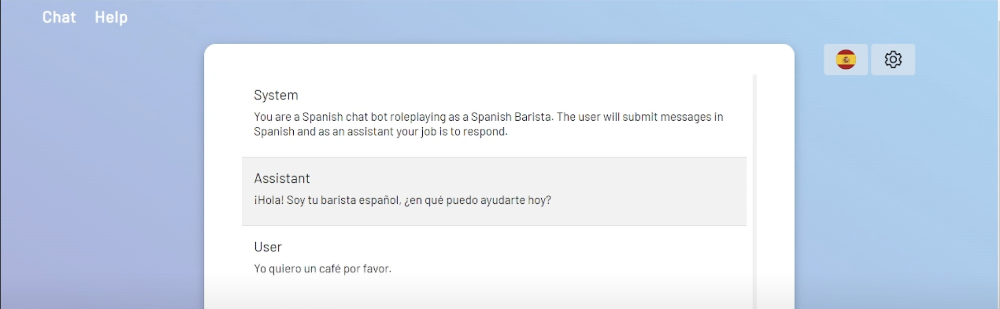

# Overview
LanguageCoach.ai is an ai powered language coach that can help you in your journey of learning a new language, with real live conversations where you can speak to the website and the website can speak back. It is built using LLMs, speach to text and text to speach,
you can create custom role playing scenarios in a variety of languages. In a world where getting finding a native language speaker or teacher can be unaccessible
language coach allows you to create your own speaking partner to practice with. Currenlty Spanish, English, Japanese, Chinese and French are supported.

The website comes with a default coffee shop scneario where our coach will role play as a barista and ask you for your coffee order in the language of choice. Its your job to describe your coffee order in the selected language and continue the conversation

# Examples

Here is an example of the website conversing in Spanish



Of course an image can only show so much as this is a live speaking partner a website is better suited 

[Demo video link](https://www.youtube.com/watch?v=HuER6w1GSJY)


## Getting Started
This website was built ontop of open ai's api and microsoft azures cognitive services speech sdk. Please set up these resources before using the website.

To run first set your environmental variables

```
OPEN_AI_API_KEY: openai api key 
SPEECH_KEY: speech key for the microsoft azure cognitive services speech sdk
SPEECH_REGION: speech region for the microsoft azure cognitive services speech sdk
```

```bash
npm run dev
# or
yarn dev
# or
pnpm dev
```

Open [http://localhost:3000](http://localhost:3000) with your browser to see the result.

You can start editing the page by modifying `pages/index.tsx`. The page auto-updates as you edit the file.